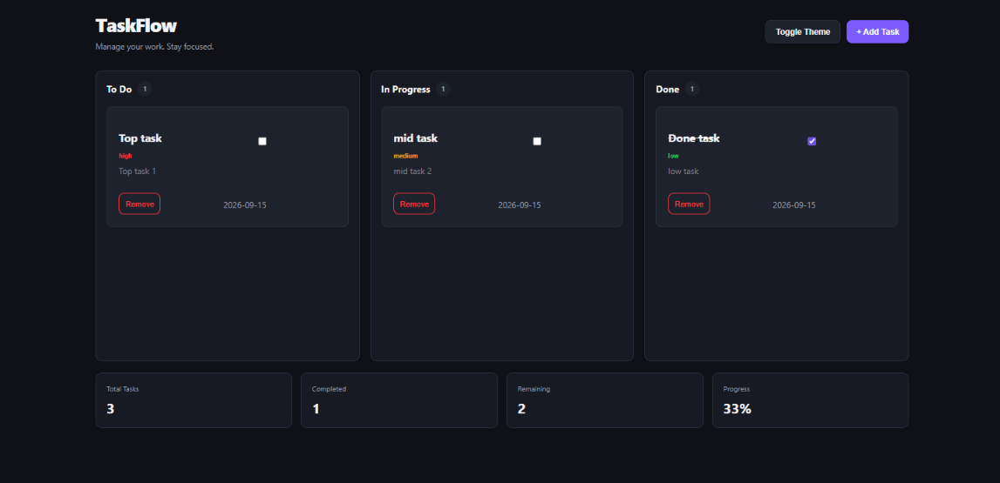

# Todo Kanban

A clean and responsive Kanban task manager built with **HTML, CSS, and JavaScript**.

The app allows users to create, organize, complete, and remove tasks across different workflow stages, with persistent data and real-time productivity statistics.

## 🌐 Live Demo

[View Live Demo](https://a-h-m-e-d-z-a-h-e-r.github.io/Todo-Kanban/)

## ✨ Features

* ➕ Create new tasks
* 📝 Add task title and description
* 🎯 Set task priority
* 📅 Add due dates
* 📋 Organize tasks into To Do, In Progress, and Done
* ✅ Mark tasks as completed
* 🗑️ Remove tasks
* 💾 Persistent task data using LocalStorage
* 📊 Real-time task statistics
* 📈 Progress percentage calculation
* 🔢 Task counters for each column
* 🌙 Light and dark theme toggle
* 🎨 Priority-based task colors
* 📱 Responsive design
* 🪟 Clean and minimal interface
* ⚡ Dynamic task rendering

## 🛠️ Tech Stack

* **HTML5**
* **CSS3**
* **JavaScript**
* **LocalStorage**
* **CSS Grid**
* **Flexbox**

## 💾 Data Persistence

TaskFlow uses the browser's **LocalStorage API** to persist task data.

Tasks remain available after refreshing or reopening the page, including:

* Task title
* Description
* Priority
* Due date
* Status

The application automatically updates LocalStorage whenever tasks are created, completed, or removed.

## 📊 Productivity Statistics

The application provides real-time statistics based on the current task list:

* Total Tasks
* Completed Tasks
* Remaining Tasks
* Completion Progress Percentage

These values are automatically recalculated whenever the task state changes.

## 🧩 Project Structure

```text
TODO Kanban/
├── index.html
├── style.css
└── script.js
````

### Architecture

* **`index.html`** — Application structure, Kanban board, statistics, and task modal.
* **`style.css`** — Complete styling, themes, responsive layout, task states, and modal UI.
* **`script.js`** — Task creation, rendering, completion, removal, LocalStorage, statistics, and theme switching.

## 📋 Task Management

Tasks can be created with:

* Title
* Description
* Priority
* Due Date
* Status

Tasks are dynamically rendered into their corresponding Kanban columns based on their current status.

Completing a task moves it to the **Done** column, while unchecking it returns it to **To Do**.

## 🎨 Interface

TaskFlow uses a clean dark interface with:

* CSS custom properties for theming
* Light and dark modes
* Responsive Kanban layout
* Priority indicators
* Interactive task cards
* Modal-based task creation
* Responsive mobile layout

## 📱 Responsive Design

The interface adapts across different screen sizes:

* Desktop — three-column Kanban board
* Tablet — two-column layout
* Mobile — single-column layout
* Small screens — optimized task cards, forms, buttons, statistics, and modal

## 🖼️ Screenshots




## 🎯 Project Goal

This project was built as a practical frontend project to strengthen **JavaScript DOM manipulation, event handling, LocalStorage, dynamic rendering, form handling, application state management, and responsive CSS**.

The goal was to build a complete task management experience using vanilla JavaScript while keeping the application lightweight and dependency-free.

## 👨‍💻 Author

**Ahmed Zaher Abdelmohsen**

Frontend Developer focused on building modern, responsive, and user-friendly web experiences.

* Portfolio: `https://a-h-m-e-d-z-a-h-e-r.github.io/Portfolio/`
* GitHub: `https://github.com/A-H-M-E-D-Z-A-H-E-R`

---

⭐ If you found this project interesting, feel free to explore the repository.

